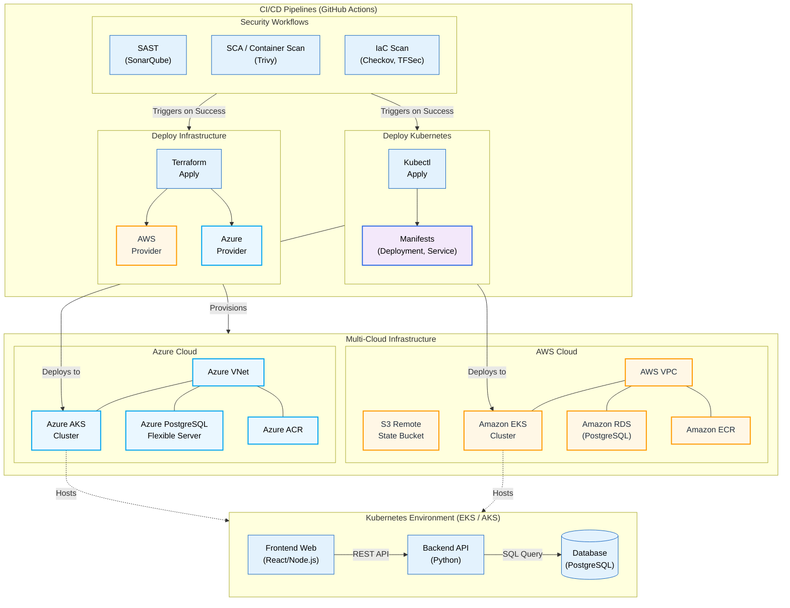

# DevSecOps Capstone Project Architecture

Here is the high-level architecture diagram representing the continuous integration, continuous deployment, and multi-cloud infrastructure setup for this project.

The diagram is generated using Mermaid.js and renders natively on GitHub.

## Overview of Components

### 1. CI/CD (GitHub Actions Workflows)
- **Security Workflows:** Pipeline steps ensuring code and infrastructure are secure before deployment. We explicitly utilize Checkov and TFSec for IaC, Trivy for container and dependency scanning, and SonarQube for SAST.
- **Infrastructure Pipeline:** Terraform authenticates securely to AWS and Azure to provision the underlying networks, container registries, managed databases, and Kubernetes clusters.
- **Kubernetes Pipeline:** `kubectl` is utilized to apply `.yaml` manifests containing deployments, pods, and services to either of the provisioned Kubernetes clusters.

### 2. Multi-Cloud Infrastructure
- **AWS Components:** Virtual Private Cloud (VPC), S3 (for remote state management), Amazon Elastic Kubernetes Service (EKS) for container orchestration, Application Load Balancer (ALB), Amazon Elastic Container Registry (ECR), and Amazon Relational Database Service (RDS - PostgreSQL).
- **Azure Components:** Virtual Network (VNet), Azure Kubernetes Service (AKS), Azure Container Registry (ACR), and Azure PostgreSQL Flexible Server. 

### 3. Kubernetes Environment
- The application stack contains a scalable Frontend user interface (React/Node.js) communicating with a Backend API service (Python). Both services connect accurately to the designated backend PostgreSQL database (which can be hosted as a container inside the cluster *or* routed to the managed AWS RDS/Azure PostgreSQL instances depending on the environment configuration).
