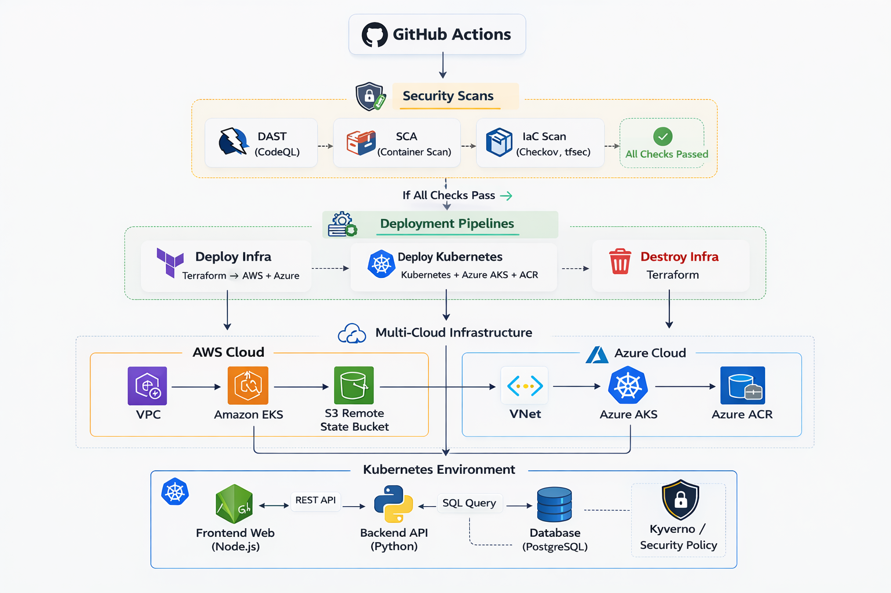

# DevSecOps Capstone Project: Expense Tracker

Welcome to the DevSecOps Capstone Project! This repository houses a full-stack personal finance application (Expense Tracker) integrated with a comprehensive, industry-standard DevSecOps pipeline.

## Project Overview

The core objective of this project is to demonstrate a robust, secure, and automated software development lifecycle (SDLC) using modern DevOps and Security (DevSecOps) practices. We are taking a web application (React frontend, Python Flask backend) and enveloping it in a fully automated infrastructure and CI/CD environment.

### Key DevSecOps Components:

- **Infrastructure as Code (IaC):** Automated provisioning of cloud environments on AWS/Azure using **Terraform**.
- **CI/CD Pipelines:** Automated workflows using **GitHub Actions** for building, testing, scanning, and deploying both infrastructure and application code.
- **Security Scanning & Compliance:**
  - **SAST (Static Application Security Testing):** Code quality and security checks using **SonarQube**.
  - **SCA (Software Composition Analysis):** Dependency and open-source vulnerability scanning using **Snyk**.
  - **IaC Security:** Scanning Terraform configurations for misconfigurations and compliance violations using **Checkov** and **tfsec**.
  - **Container & K8s Security:** Scanning Docker images and Kubernetes manifests using **Trivy**.
- **Containerization & Orchestration:** Packaging the application using **Docker** and deploying it to a **Kubernetes** cluster, fortified with Network Policies and Pod Security Standards.

## 🏗️ Architecture & CI/CD Pipeline Flow



## 📁 Repository Structure

```text
expense-tracker/
├── .github/
│   └── workflows/          # GitHub Actions CI/CD pipelines
│       ├── sonarqube.yml   # SAST Code Quality scan (SonarQube)
│       ├── snyk-sca.yml    # SCA Dependency scan (Snyk)
│       ├── checkov.yml     # IaC Security scan (Checkov)
│       ├── tfsec.yml       # IaC Security scan (tfsec)
│       ├── trivy.yml       # Container & K8s vulnerability scan
│       ├── codeql.yml      # Advanced static code analysis
│       ├── deploy-infra.yml# Terraform provision to AWS/Azure
│       └── destroy-infra.yml# Terraform destroy environment
├── backend/                # Python Flask REST API
│   ├── app.py              # Application entrypoint
│   ├── models/             # Database models
│   ├── routes/             # API endpoints
│   ├── requirements.txt    # Python dependencies
│   └── Dockerfile          # Container build definition
├── frontend/               # React User Interface
│   ├── src/                # UI components and API clients
│   ├── package.json        # Node.js dependencies
│   └── Dockerfile          # Container build definition
├── k8s/                    # Kubernetes Manifests
│   ├── deployment.yaml     # Pod deployments & replicas
│   ├── service.yaml        # Service exposure
│   ├── network-policy.yaml # Zero-trust network restrictions
│   └── pod-security.yaml   # Pod security standards (PSS)
└── terraform/              # Infrastructure as Code
    ├── main.tf             # Core infrastructure (EKS/AKS, VPC/VNet)
    ├── variables.tf        # Input variables
    └── provider.tf         # Cloud providers config
```

## ⚙️ CI/CD Workflows (GitHub Actions)

This project leverages automated **GitHub Actions** pipelines to enforce security and smoothly deploy our changes.

| Workflow | Trigger | Description |
|---|---|---|
| **SonarQube SAST** (`sonarqube.yml`) | Push / PR | Performs Static Application Security Testing (SAST) using SonarQube to identify code smells, bugs, and security hotspots in both frontend and backend code. |
| **Snyk SCA** (`snyk-sca.yml`) | Push / PR | Runs Software Composition Analysis (SCA) via Snyk to detect known vulnerabilities in open-source dependencies (e.g., in `package.json` and `requirements.txt`). |
| **Checkov IaC Scan** (`checkov.yml`) | PR to Main | Scans the `terraform/` directory using Checkov to detect misconfigurations and ensure compliance with best practices before provisioning resources. |
| **tfsec IaC Scan** (`tfsec.yml`) | PR to Main | A secondary, focused static analysis tool for Terraform code, providing an extra layer of validation against cloud misconfigurations. |
| **Trivy Container & K8s Scan** (`trivy.yml`) | Post-Build | Scans the built Docker images for CVEs (Common Vulnerabilities and Exposures) and checks Kubernetes manifest files for insecure configurations. |
| **CodeQL Analysis** (`codeql.yml`) | Scheduled / Push | GitHub's native advanced static analysis engine that queries our codebase for deeply hidden security vulnerabilities across supported languages. |
| **Deploy Infra** (`deploy-infra.yml`) | Manual (Workflow Dispatch) | Provisions the cloud infrastructure (AWS EKS or Azure AKS) by fully automating the `terraform init`, `plan`, and `apply` steps securely. |
| **Destroy Infra** (`destroy-infra.yml`) | Manual (Workflow Dispatch) | Cleanly and safely tears down all provisioned cloud resources (`terraform destroy`) to prevent unwanted billing outside of active development windows. |
