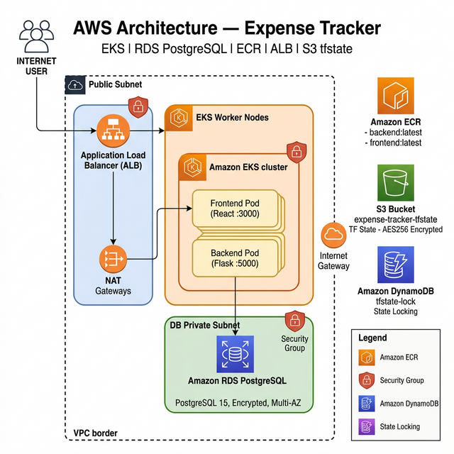
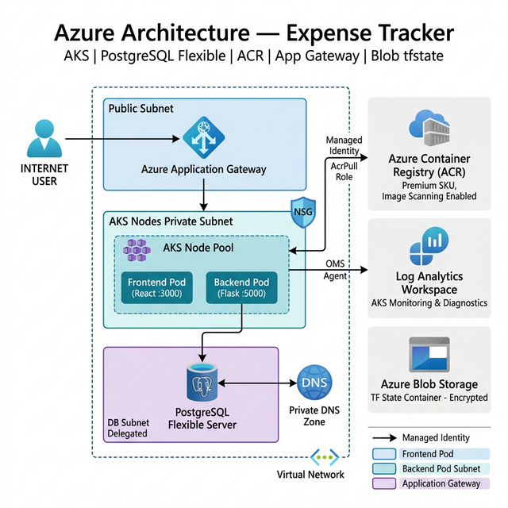

# Terraform Infrastructure — Expense Tracker App

This directory contains Terraform Infrastructure as Code (IaC) to deploy the Expense Tracker application on two cloud providers:

| Folder | Cloud | Key Services |
|--------|-------|-------------|
| [`aws/`](./aws/) | Amazon Web Services | EKS, RDS PostgreSQL, ECR, ALB, VPC |
| [`azure/`](./azure/) | Microsoft Azure | AKS, PostgreSQL Flexible, ACR, App Gateway, VNet |

Both configurations store Terraform state **remotely and encrypted** — AWS uses S3 + DynamoDB, Azure uses Blob Storage.

---

## AWS Architecture



### Components

| Resource | Service | Details |
|----------|---------|---------|
| **Networking** | VPC | `10.0.0.0/16`, 2 public + 2 private subnets across 2 AZs |
| **Load Balancer** | ALB | Public-facing, HTTP → HTTPS redirect, access logs to S3 |
| **Container Orchestration** | EKS | v1.29, managed node group in private subnets, audit logs enabled |
| **Container Registry** | ECR | Immutable tags, scan-on-push, AES256 encryption |
| **Database** | RDS PostgreSQL 15 | Private subnet, encrypted, Multi-AZ in prod, 7-day backups |
| **Remote State** | S3 + DynamoDB | AES256 encrypted bucket + DynamoDB lock table |

### AWS — Quick Start

**Step 1: Bootstrap remote state** (once only)
```bash
# Create S3 bucket for tfstate
aws s3api create-bucket --bucket expense-tracker-tfstate --region us-east-1
aws s3api put-bucket-versioning \
  --bucket expense-tracker-tfstate \
  --versioning-configuration Status=Enabled
aws s3api put-bucket-encryption \
  --bucket expense-tracker-tfstate \
  --server-side-encryption-configuration \
  '{"Rules":[{"ApplyServerSideEncryptionByDefault":{"SSEAlgorithm":"AES256"}}]}'

# Create DynamoDB lock table
aws dynamodb create-table \
  --table-name expense-tracker-tfstate-lock \
  --attribute-definitions AttributeName=LockID,AttributeType=S \
  --key-schema AttributeName=LockID,KeyType=HASH \
  --billing-mode PAY_PER_REQUEST \
  --region us-east-1
```

**Step 2: Deploy**
```bash
cd terraform/aws
terraform init
terraform plan -var="db_password=<YOUR_DB_PASSWORD>"
terraform apply -var="db_password=<YOUR_DB_PASSWORD>"
```

**Step 3: Configure kubectl**
```bash
aws eks update-kubeconfig --region us-east-1 --name expense-tracker-eks
kubectl apply -f ../../k8s/
```

**Step 4: Push images to ECR**
```bash
# Get ECR URL from terraform output
ECR_URL=$(terraform output -raw ecr_backend_url)
aws ecr get-login-password --region us-east-1 | docker login --username AWS --password-stdin $ECR_URL

docker tag backend:latest $ECR_URL:latest
docker push $ECR_URL:latest
```

---

## Azure Architecture



### Components

| Resource | Service | Details |
|----------|---------|---------|
| **Networking** | VNet | `10.1.0.0/16`, public + AKS private + DB delegated subnets |
| **Load Balancer** | App Gateway | Standard, public-facing, integrated with AKS |
| **Container Orchestration** | AKS | v1.29, auto-scaling (1–4 nodes), Azure CNI + Calico, RBAC |
| **Container Registry** | ACR | Premium SKU, quarantine + trust policy, AcrPull via managed identity |
| **Database** | PostgreSQL Flexible Server | Private (delegated subnet), private DNS, geo-redundant in prod |
| **Monitoring** | Log Analytics | OMS agent on AKS, 30-day retention |
| **Remote State** | Azure Blob Storage | Encrypted-at-rest, HTTPS-only, TLS 1.2 minimum |

### Azure — Quick Start

**Step 1: Bootstrap remote state** (once only)
```bash
RESOURCE_GROUP="expense-tracker-tfstate-rg"
STORAGE_ACCOUNT="expensetfstate$(date +%s)"
az group create --name $RESOURCE_GROUP --location eastus
az storage account create \
  --name $STORAGE_ACCOUNT \
  --resource-group $RESOURCE_GROUP \
  --sku Standard_LRS --https-only true --min-tls-version TLS1_2
az storage container create --name tfstate --account-name $STORAGE_ACCOUNT

# Update azure/providers.tf with your storage account name
```

**Step 2: Deploy**
```bash
cd terraform/azure
terraform init
terraform plan -var="db_admin_password=<YOUR_DB_PASSWORD>"
terraform apply -var="db_admin_password=<YOUR_DB_PASSWORD>"
```

**Step 3: Configure kubectl**
```bash
az aks get-credentials \
  --resource-group expense-tracker-dev-rg \
  --name expense-tracker-aks
kubectl apply -f ../../k8s/
```

**Step 4: Push images to ACR**
```bash
ACR_URL=$(terraform output -raw acr_login_server)
az acr login --name $(echo $ACR_URL | cut -d. -f1)
docker tag backend:latest $ACR_URL/expense-tracker/backend:latest
docker push $ACR_URL/expense-tracker/backend:latest
```

---

## Destroying Infrastructure

```bash
# AWS
cd terraform/aws
terraform destroy -var="db_password=<YOUR_DB_PASSWORD>"

# Azure
cd terraform/azure
terraform destroy -var="db_admin_password=<YOUR_DB_PASSWORD>"
```

> ⚠️ **Warning**: In `prod` environment, RDS deletion protection and the Azure resource group prevent accidental deletion. You must set `deletion_protection = false` in `rds.tf` / remove the resource group protection before destroy.

---

## File Structure

```
terraform/
├── aws/
│   ├── providers.tf        # AWS provider + S3 backend config
│   ├── variables.tf        # Input variables
│   ├── vpc.tf              # VPC, subnets, IGW, NAT gateways
│   ├── security_groups.tf  # ALB, EKS, RDS security groups
│   ├── eks.tf              # EKS cluster + node group + IAM
│   ├── ecr.tf              # ECR repos (backend + frontend)
│   ├── rds.tf              # RDS PostgreSQL instance
│   ├── alb.tf              # Application Load Balancer
│   └── outputs.tf          # Useful outputs
├── azure/
│   ├── providers.tf        # Azure provider + Blob backend config
│   ├── variables.tf        # Input variables
│   ├── resource_group.tf   # Resource group
│   ├── vnet.tf             # VNet, subnets, NSG, private DNS
│   ├── aks.tf              # AKS cluster + Log Analytics
│   ├── acr.tf              # Azure Container Registry
│   ├── postgres.tf         # PostgreSQL Flexible Server
│   └── outputs.tf          # Useful outputs
├── aws_architecture.png    # AWS architecture diagram
├── azure_architecture.png  # Azure architecture diagram
└── README.md               # This file
```
